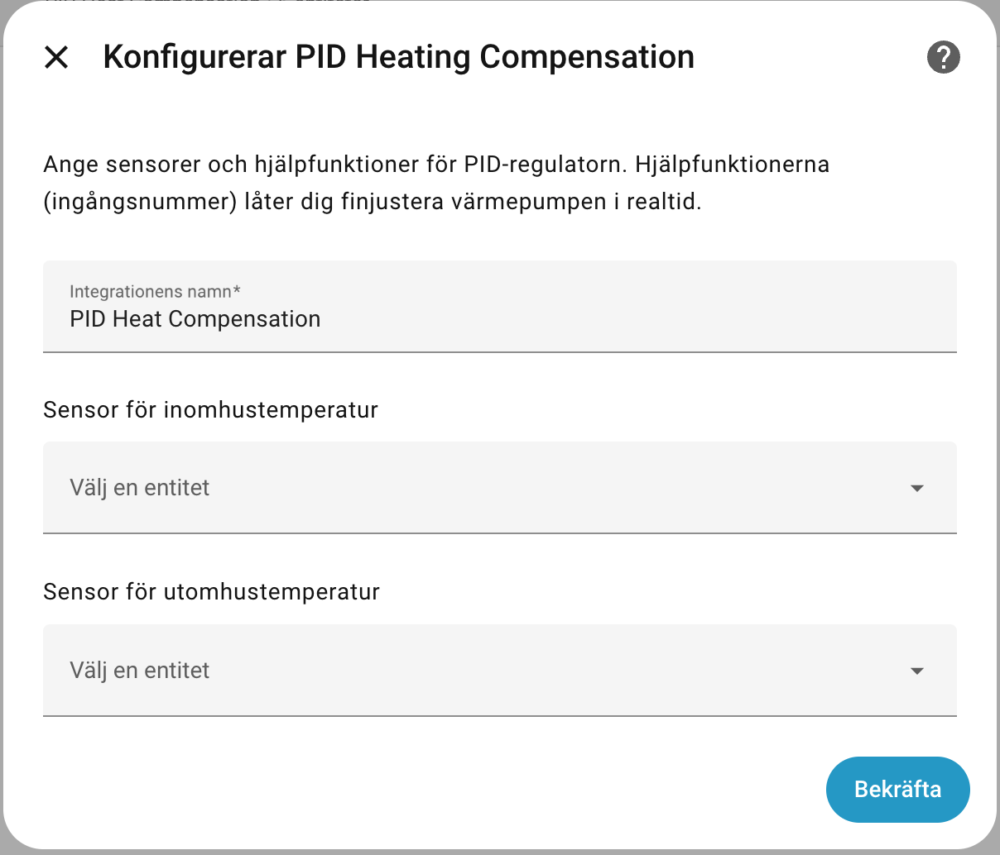

# PID Heat Compensation Controller
Smart Heating Control for Home Assistant

This Home Assistant Custom Integration optimizes heat pump performance by calculating a **Compensated Outdoor Temperature** ($T_{comp}$). 

Instead of relying solely on the heat pump's static heating curve, this integration uses a **PID (Proportional-Integral-Derivative) Controller** to dynamically adjust the control signal based on the actual real-time indoor temperature.

## Project Structure
- `custom_components/pid_heat_compensation/`: The core logic for the PID calculation.
- `packages/pid_heat_compensation.yaml`: Helpers (input_numbers) and template sensors for easy UI integration.

## How It Works

Most heat pumps are governed by an outdoor sensor and a pre-defined heating curve. By providing the heat pump with a modified outdoor temperature value ($T_{comp}$), we can "nudge" the system to increase or decrease production more intelligently than a standard binary thermostat.

* **If Indoor < Setpoint:** $T_{comp}$ is lowered (The heat pump believes it is colder outside than it actually is and increases heat production).
* **If Indoor > Setpoint:** $T_{comp}$ is raised (The heat pump believes it is warmer outside and decreases production).

## The Weather Factor Formula

The integration calculates the compensated temperature using the following logic:

$$T_{comp} = T_{outdoor} - (\Delta T \times \text{weather\_factor})$$

Where:
- **$\Delta T$**: The difference between target and actual indoor temperature.
- **weather_factor**: A multiplier that defines how aggressively the system should react to temperature deviations and external conditions (wind, sun, etc.).

**Example:**
If it's 7°C outside and the house is 1°C below target, a weather factor of 2.0 will result in:
$7.0 - (1.0 \times 2.0) = 5.0°C$
The heat pump receives 5°C and increases its output accordingly.

## Installation
1. Copy the `custom_components/pid_heat_compensation/` folder to your Home Assistant `config/custom_components/` directory.
2. Copy `other/packages.yaml` to your `config/packages/` naming it `pid_heat_compensation.yaml` directory (ensure packages are enabled in your `configuration.yaml`).
3. Restart Home Assistant.
4.  Add the sensor via your `configuration.yaml` or through the Integrations UI.



## Configuration (PID Tuning)

In `sensor.py`, you will find three primary parameters that dictate how the system reacts. Adjust these to suit your home's specific thermal mass:

| Parameter | Name | Description | Default |
| :--- | :--- | :--- | :--- |
| **Kp** | Proportional | Reacts to the current error. Higher value = faster, more aggressive reaction. | -`2.0` |
| **Ki** | Integral | Eliminates residual error over time. Prevents the temperature from "stalling" just below the target. | `0` |
| **Kd** | Derivative | Dampens the reaction if the temperature changes too quickly, preventing "overshoot." | `0` |

## Automation Example

To send the calculated value to your heat pump, create an automation that triggers whenever the sensor state changes:
Make sure to change the target entity id to your corret one

```yaml
alias: "Värme: Uppdatera Ohmigo sensor"
description: ""
triggers:
  - trigger: time_pattern
    minutes: /15
conditions: []
actions:
  - data:
      value: >-
        {{ states('sensor.pid_heat_compensation_compensated_outdoor_temp') |
        float }}
    target:
      entity_id:
        - number.ohmonwifiplus_402552_temperature_set
    action: number.set_value
mode: single

